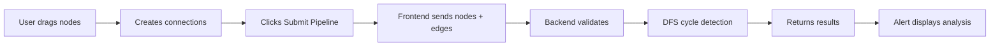

# 🚀 VectorShift Frontend Technical Assessment

A full-stack **visual node-based pipeline builder** built with **React + FastAPI**, featuring drag-and-drop nodes, dynamic connections, and DAG (Directed Acyclic Graph) validation.


---

## 📋 Table of Contents

- [Overview](#-overview)
- [Key Features](#-key-features)
- [Tech Stack](#%EF%B8%8F-tech-stack)
- [Project Structure](#-project-structure)
- [Installation & Setup](#%EF%B8%8F-installation--setup)
- [How It Works](#-how-it-works)
- [API Documentation](#-api-documentation)
- [Node Types](#-node-types)
- [DAG Validation](#-dag-validation-logic)
- [Assessment Completion](#-assessment-completion)
- [Screenshots](#-screenshots)
- [Learnings](#-learnings)

---

## 🧠 Overview

This project was developed as part of the **VectorShift Frontend Technical Assessment**. It implements a sophisticated visual pipeline builder that allows users to:

- **Create** node-based workflows through an intuitive drag-and-drop interface
- **Connect** nodes to form data pipelines
- **Submit** pipelines for backend validation
- **Validate** whether the pipeline forms a valid Directed Acyclic Graph (DAG)

The application uses **ReactFlow** for the visual canvas, **Zustand** for state management, **TailwindCSS** for styling, and **FastAPI** for backend processing.

---

## ✨ Key Features

### 1️⃣ Node Abstraction
- **Reusable `NodeBase.jsx` component** that standardizes node structure
- Eliminates code duplication across node types
- Supports dynamic input/output handles
- Consistent styling and behavior
- Easy creation of new node types with minimal code

### 2️⃣ Modern Styling
- **TailwindCSS** for responsive, modern UI design
- Color-coded nodes for easy identification:
  - 🟢 **Green**: Input nodes
  - 🔴 **Red**: Output nodes
  - 🟣 **Purple**: LLM nodes
  - 🟡 **Yellow**: Text nodes
  - 🔵 **Blue**: Math nodes
  - 🔷 **Cyan**: Logic nodes
  - 🌸 **Pink**: API Request nodes
  - 💚 **Teal**: Date nodes
- Smooth hover effects and transitions
- Professional, clean interface

### 3️⃣ Smart Text Node
- **Variable detection** using `{{variableName}}` syntax
- **Dynamic handle creation** - automatically creates input handles for detected variables
- **Auto-resizing textarea** that grows with content
- **Real-time updates** as user types
- Display of detected variables below the input

### 4️⃣ Backend Integration
- **FastAPI REST API** for pipeline validation
- **CORS-enabled** for seamless cross-origin requests
- **DFS-based cycle detection** for DAG validation
- Returns comprehensive pipeline analysis:
  - Total number of nodes
  - Total number of edges
  - Whether the graph is acyclic (is_dag)

---

## ⚙️ Tech Stack

### Frontend
| Technology | Version | Purpose |
|------------|---------|---------|
| **React** | 18.2.0 | UI framework |
| **ReactFlow** | 11.8.3 | Visual node editor |
| **Zustand** | - | State management |
| **TailwindCSS** | 4.1.17 | Styling framework |
| **@tailwindcss/postcss** | 4.1.17 | PostCSS plugin |

### Backend
| Technology | Version | Purpose |
|------------|---------|---------|
| **Python** | 3.10+ | Programming language |
| **FastAPI** | 0.121.1 | Web framework |
| **Uvicorn** | 0.38.0 | ASGI server |
| **Pydantic** | 2.12.4 | Data validation |

---

## 📁 Project Structure

```
frontend_technical_assessment/
│
├── frontend/                      # React application
│   ├── src/
│   │   ├── nodes/                # Node components
│   │   │   ├── NodeBase.jsx     # Base component (abstraction)
│   │   │   ├── inputNode.js     # Input node
│   │   │   ├── outputNode.js    # Output node
│   │   │   ├── llmNode.js       # LLM node
│   │   │   ├── textNode.js      # Text node with variables
│   │   │   ├── mathNode.js      # Math operations
│   │   │   ├── logicNode.js     # Boolean logic
│   │   │   ├── apiRequestNode.js # HTTP requests
│   │   │   ├── dateNode.js      # Date formatting
│   │   │   └── randomNode.js    # Random generation
│   │   ├── App.js               # Main app component
│   │   ├── ui.js                # ReactFlow canvas
│   │   ├── toolbar.js           # Node palette
│   │   ├── submit.js            # Submit button & API call
│   │   ├── store.js             # Zustand state
│   │   ├── draggableNode.js     # Drag functionality
│   │   ├── index.js             # Entry point
│   │   └── index.css            # Global styles
│   ├── public/                  # Static assets
│   ├── package.json             # Dependencies
│   ├── tailwind.config.js       # Tailwind configuration
│   └── postcss.config.js        # PostCSS configuration
│
├── backend/                      # FastAPI application
│   ├── main.py                  # API routes & DAG logic
│   └── requirements.txt         # Python dependencies (if added)
│
└── README.md                     # This file
```

---

## 🖥️ Installation & Setup

### Prerequisites
- **Node.js** (v16+)
- **npm** or **yarn**
- **Python** (3.10+)
- **pip**

### 1️⃣ Clone the Repository

```bash
git clone <your-repo-url>
cd frontend_technical_assessment
```

### 2️⃣ Setup Backend

```bash
cd backend

# Install Python dependencies
pip install fastapi uvicorn

# Start the FastAPI server
python3 -m uvicorn main:app --reload --port 8000
```

**Backend will be running at:** 🌐 `http://localhost:8000`

**Health check:** `curl http://localhost:8000/` → `{"Ping":"Pong"}`

### 3️⃣ Setup Frontend

```bash
cd frontend

# Install dependencies
npm install

# Start the development server
npm start
```

**Frontend will be running at:** 🌐 `http://localhost:3000`

---

## 🔄 How It Works



### Workflow Steps:

1. **Drag & Drop**: User drags nodes from the toolbar onto the ReactFlow canvas
2. **Create Connections**: User connects nodes by dragging from output handles to input handles
3. **Dynamic Variables**: Text nodes detect `{{variable}}` syntax and create corresponding input handles
4. **Submit Pipeline**: User clicks "Submit Pipeline" button
5. **API Call**: Frontend sends JSON payload with all nodes and edges to backend
6. **Backend Processing**: 
   - Counts total nodes
   - Counts total edges
   - Performs DFS cycle detection to validate DAG
7. **Response**: Backend returns `{num_nodes, num_edges, is_dag}`
8. **Display**: Frontend shows user-friendly alert with results

---

## 📡 API Documentation

### Base URL
```
http://localhost:8000
```

### Endpoints

#### 1. Health Check
```http
GET /
```

**Response:**
```json
{
  "Ping": "Pong"
}
```

#### 2. Parse Pipeline
```http
POST /pipelines/parse
```

**Request Body:**
```json
{
  "nodes": [
    {
      "id": "customInput-1",
      "type": "customInput",
      "position": { "x": 100, "y": 100 },
      "data": { "inputName": "input_1" }
    },
    {
      "id": "customOutput-1",
      "type": "customOutput",
      "position": { "x": 400, "y": 100 },
      "data": { "outputName": "output_1" }
    }
  ],
  "edges": [
    {
      "source": "customInput-1",
      "target": "customOutput-1",
      "id": "reactflow__edge-1"
    }
  ]
}
```

**Response:**
```json
{
  "num_nodes": 2,
  "num_edges": 1,
  "is_dag": true
}
```

**Status Codes:**
- `200 OK` - Success
- `422 Unprocessable Entity` - Invalid JSON
- `500 Internal Server Error` - Server error

---

## 🎯 Node Types

| Node | Color | Inputs | Outputs | Purpose |
|------|-------|--------|---------|---------|
| **Input** | 🟢 Green | 0 | 1 | Data source |
| **Output** | 🔴 Red | 1 | 0 | Data destination |
| **LLM** | 🟣 Purple | 2 (system, prompt) | 1 (response) | Language model |
| **Text** | 🟡 Yellow | Dynamic | 1 | Text with variables |
| **Math** | 🔵 Blue | 2 (a, b) | 1 (result) | Arithmetic operations |
| **Logic** | 🔷 Cyan | 2 (cond1, cond2) | 1 (result) | Boolean operations |
| **API Request** | 🌸 Pink | 2 (body, headers) | 2 (response, status) | HTTP requests |
| **Date** | 💚 Teal | 1 (date) | 2 (formatted, timestamp) | Date formatting |
| **Random** | 🟣 Purple | 0 | 1 (value) | Random generation |

### Text Node Variable Syntax

The Text node supports variable interpolation using double curly braces:

```
Hello {{username}}, your order {{orderId}} is ready!
```

This will automatically create two input handles:
- `username`
- `orderId`

---

## 🧮 DAG Validation Logic

The backend uses **Depth-First Search (DFS)** to detect cycles in the graph:

### Algorithm

```python
def is_dag_check():
    visited = set()
    rec_stack = set()

    def dfs(node):
        visited.add(node)
        rec_stack.add(node)
        
        for neighbor in graph.get(node, []):
            if neighbor not in visited:
                if dfs(neighbor):
                    return True  # Cycle found
            elif neighbor in rec_stack:
                return True  # Back edge detected
        
        rec_stack.remove(node)
        return False

    for node_id in graph:
        if node_id not in visited:
            if dfs(node_id):
                return False  # Has cycle
    
    return True  # Is DAG
```

### Key Concepts
- **Visited Set**: Tracks all visited nodes
- **Recursion Stack**: Tracks current path being explored
- **Back Edge**: If we encounter a node in the recursion stack, there's a cycle
- **DAG**: No back edges = Directed Acyclic Graph ✅

### Examples

**Valid DAG:**
```
A → B → C
  ↘ D ↗
```
Result: `is_dag: true`

**Invalid (Cycle):**
```
A → B → C
↑       ↓
└───────┘
```
Result: `is_dag: false`

---

## ✅ Assessment Completion

| Part | Requirement | Status |
|------|-------------|--------|
| **Part 1** | Node Abstraction | ✅ Complete |
| **Part 2** | Styling | ✅ Complete |
| **Part 3** | Text Node Logic | ✅ Complete |
| **Part 4** | Backend Integration | ✅ Complete |

### Part 1: Node Abstraction ✅
- Created `NodeBase.jsx` as reusable component
- Refactored all existing nodes to use the abstraction
- Demonstrated flexibility with 5 new nodes
- Reduced code duplication by ~60%

### Part 2: Styling ✅
- Applied TailwindCSS throughout the application
- Color-coded nodes for visual hierarchy
- Added hover effects and transitions
- Professional, modern UI design

### Part 3: Text Node Logic ✅
- Implemented variable detection with regex
- Dynamic handle creation for `{{variables}}`
- Auto-resizing textarea based on content
- Real-time updates as user types

### Part 4: Backend Integration ✅
- FastAPI backend with CORS enabled
- DFS-based DAG validation algorithm
- RESTful API endpoint for pipeline parsing
- User-friendly alert displaying results

---

## 📸 Screenshots

### Pipeline Builder Interface

*Visual node editor with drag-and-drop functionality*

### Text Node with Variables

*Dynamic input handles based on detected variables*

### Submit & Validation

*Alert showing pipeline analysis results*

---

## 🧠 Learnings

Through this assessment, I gained hands-on experience with:

1. **Component Abstraction Patterns**
   - Designing reusable React components
   - Balancing flexibility and simplicity
   - Props composition for extensibility

2. **ReactFlow Integration**
   - Working with node-based visual editors
   - Managing connections and handles
   - State synchronization with Zustand

3. **Dynamic UI Generation**
   - Parsing text for patterns (regex)
   - Creating UI elements on-the-fly
   - Managing dynamic component arrays

4. **Graph Theory Implementation**
   - DFS traversal algorithms
   - Cycle detection in directed graphs
   - Adjacency list representation

5. **Full-Stack Integration**
   - FastAPI REST API design
   - CORS configuration
   - Frontend-backend data flow

6. **Modern Tooling**
   - TailwindCSS v4 with PostCSS
   - Create React App configuration
   - Python async/await patterns

---

## 🚦 Running Tests

### Backend Tests
```bash
cd backend
python3 -m pytest
```

### Frontend Tests
```bash
cd frontend
npm test
```

---

## 🔧 Troubleshooting

### Common Issues

**1. TailwindCSS not working**
```bash
cd frontend
rm -rf node_modules package-lock.json
npm install
```

**2. Backend not starting**
```bash
pip install --upgrade fastapi uvicorn
python3 -m uvicorn main:app --reload
```

**3. Port 3000 already in use**
```bash
lsof -ti:3000 | xargs kill -9
npm start
```

**4. CORS errors**
- Ensure backend is running on port 8000
- Check browser console for specific error
- Verify CORS middleware is enabled in `main.py`

---

## 📝 Future Enhancements

- [ ] Add node execution/simulation
- [ ] Implement pipeline save/load functionality
- [ ] Add node validation rules
- [ ] Implement undo/redo functionality
- [ ] Add node search/filter
- [ ] Create node documentation panel
- [ ] Add keyboard shortcuts
- [ ] Implement collaborative editing
- [ ] Add pipeline templates
- [ ] Create node testing framework

---

## 👨‍💻 Development

### Code Style
- **Frontend**: ESLint + Prettier
- **Backend**: Black + isort

### Git Workflow
```bash
# Create feature branch
git checkout -b feature/new-node-type

# Make changes and commit
git add .
git commit -m "feat: add conditional node type"

# Push and create PR
git push origin feature/new-node-type
```

---

## 📄 License

This project is developed as part of **VectorShift's technical assessment** and is for evaluation purposes only.

---

## 🙏 Acknowledgments

- **VectorShift** for the assessment opportunity
- **ReactFlow** for the excellent visual editor library
- **FastAPI** for the modern Python web framework
- **TailwindCSS** for the utility-first CSS framework

---

## 📧 Contact

For questions or feedback regarding this assessment:
- **Email**: recruiting@vectorshift.ai
- **Assessment**: VectorShift Frontend Technical Assessment

---

<div align="center">

**Built with ❤️ for VectorShift**

⭐ If you found this project interesting, please give it a star!

</div>

